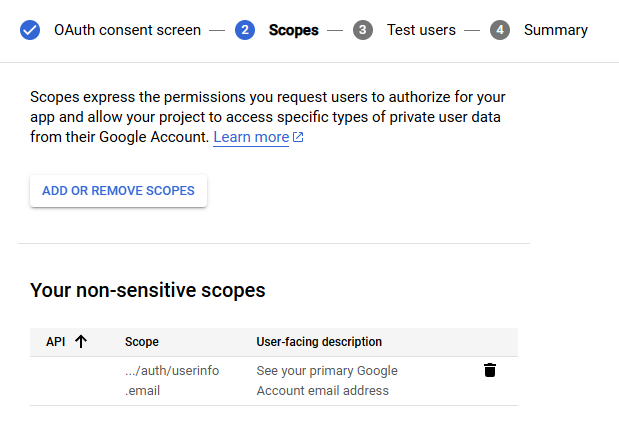

EZAuth offers a way to authenticate users via OAuth. This is a more secure way to authenticate users and also simplifies the registration process for users.
The following Rules are applied when using OAuth:<br>

- A new user is created when the user logs in for the first time with oauth (Username and E-Mail get derived from the OAuth Provider)

- The user can log in with the same OAuth Provider again and again

- The user can reset his password after logging in with OAuth and is the able to log in without OAuth

- If there is a user with the same E-Mail as the OAuth Provider, the OAuth will be linked to the existing user

- OAuth is a full replacement for the normal login process

## Google OAuth
### Setup Google OAuth
1. Go to the [Google Cloud Console](https://console.cloud.google.com/).
2. Create a new project.
3. Go to the [APIs & Services -> Credentials](https://console.cloud.google.com/apis/credentials) section.
4. Click on `Create credentials` and select `OAuth client ID`.
5. Select `Web application` as the application type.
6. Add the following URIs to the `Authorized redirect URIs` (Where `{BASE_URL}` is the Hostname of the server eg. `http://test.com`):
    - `{BASE_URL}/oauth/google/callback`
7. Add the following scopes


8. Click on `Create` and download the credentials as JSON and place them in the `config` folder.
Make sure the name of the file is `google_client_secret.env.json`.

## GitHub OAuth
### Setup GitHub OAuth
1. Go to the [GitHub Developer Settings](https://github.com/settings/developers)
2. Click on `New OAuth App`.
3. Add the following URIs to the `Authorization callback URL` (Where `{BASE_URL}` is the Hostname of the server eg. `http://localhost:3250`):
    - `{BASE_URL}/oauth/github/callback`
4. Create the Application and copy the `Client ID` and `Client Secret` and create the following file in the `config` folder.

```json title="github_client_secret.env.json"
{
    "client_id": "YOUR_CLIENT",
    "client_secret": "YOUR_SECRET"
}
```